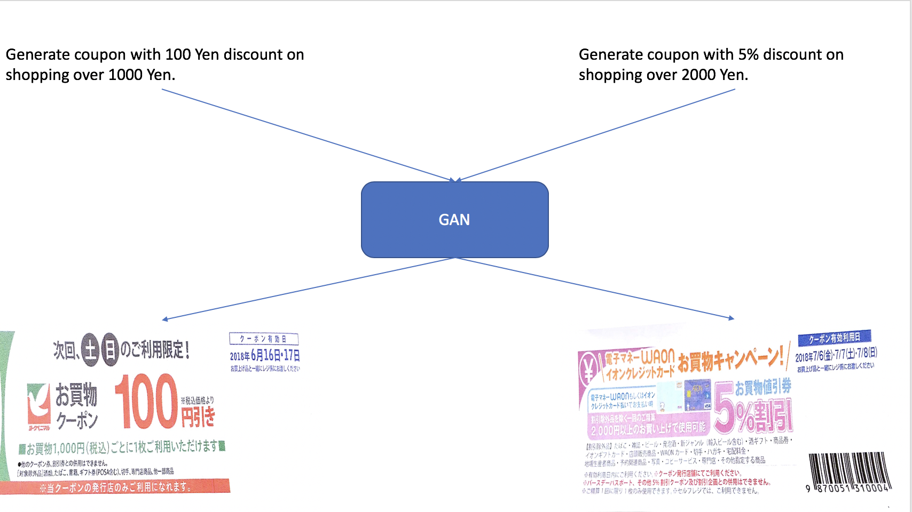
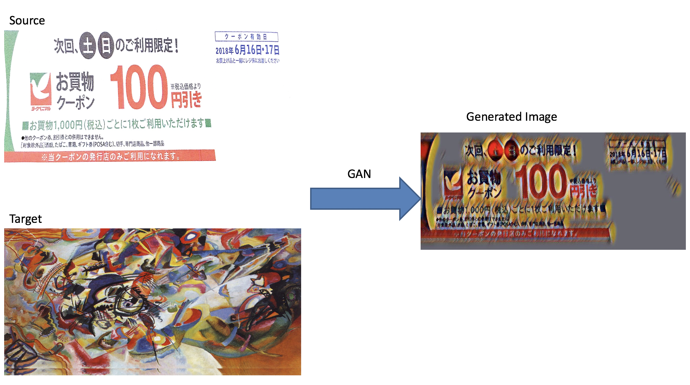
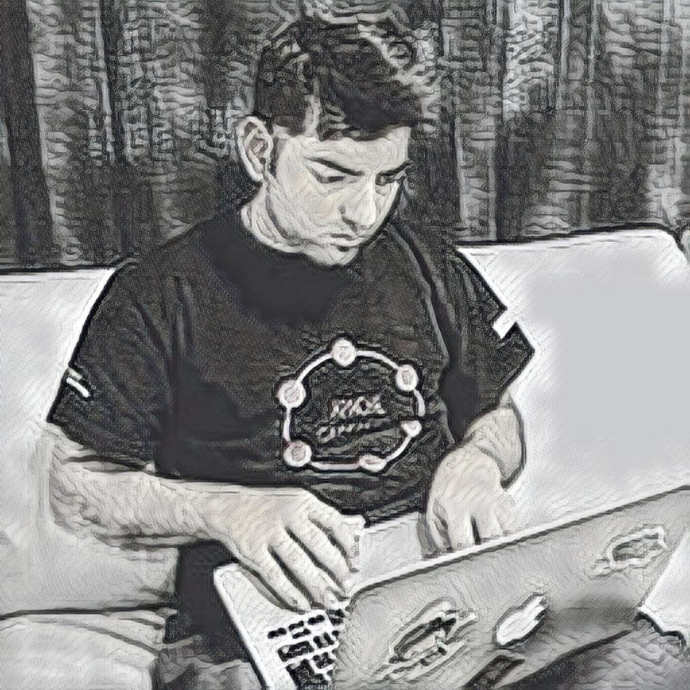
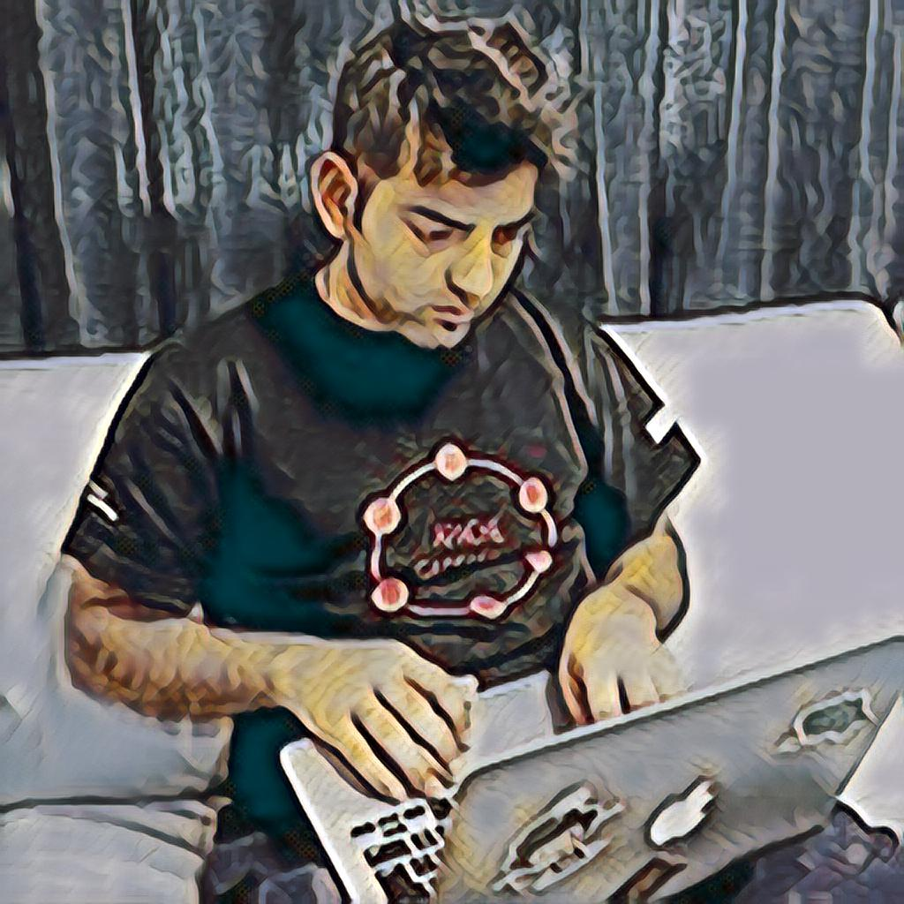
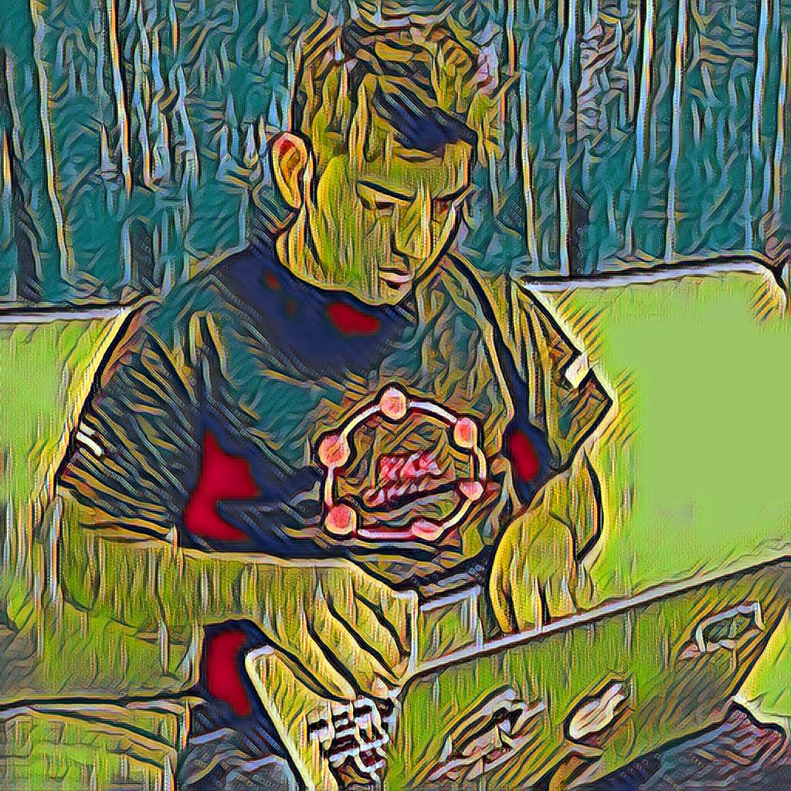
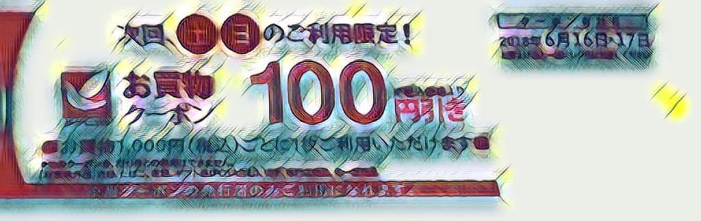
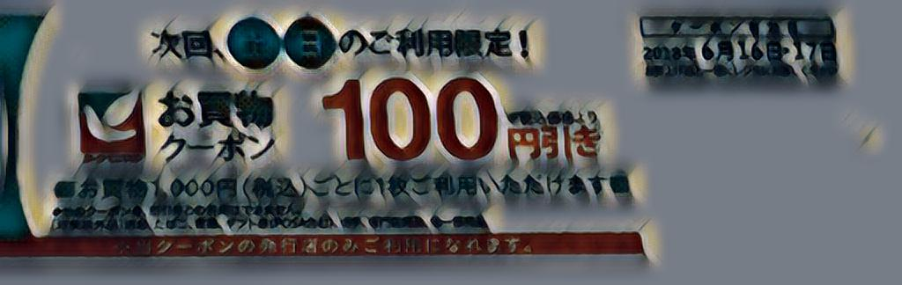
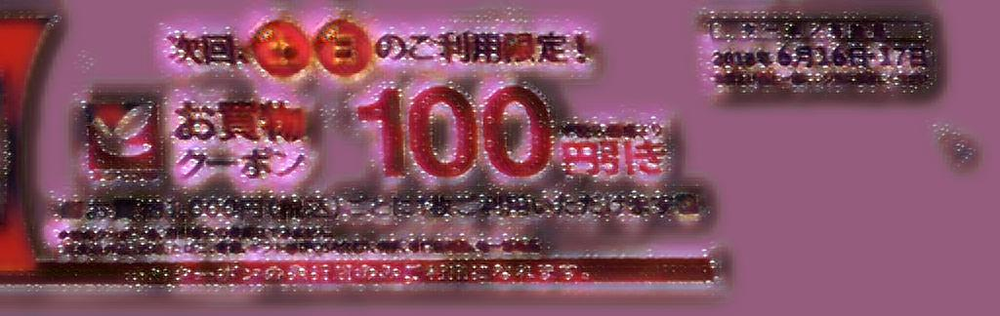
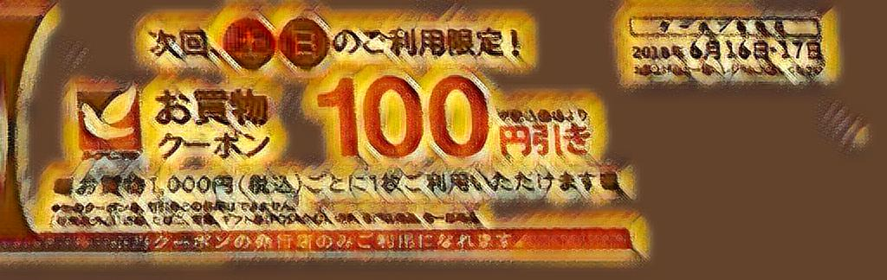

# GAN-coupon-art

Pytorch implementation of msg-net and style transfer. 


### My Idea
 
 
 

**Tabe of content**

* [Real-time Style Transfer using MSG-Net](#msg-net)
	- [Stylize Images using Pre-trained Model](#stylize-images-using-pre-trained-msg-net)
	- [Train Your Own MSG-Net Model](#train-your-own-msg-net-model)
* [Slow Neural Style Transfer](#neural-style)


### Stylize Images Using Pre-trained MSG-Net

0. Download the pre-trained model

	```
	git clone https://gitlab.catmktg.com/amishra/GAN-coupon-art.git
	cd GAN-coupon-art/experiments
	bash models/download_model.sh
	```
0. Camera Demo  

	```
	python camera_demo.py demo --model models/21styles.model
	```
	
0. Test the model  

	```
	python main.py eval --content-image images/content/venice-boat.jpg --style-image images/21styles/candy.jpg --model models/21styles.model --content-size 1024
	```
* If you don't have a GPU, simply set `--cuda=0`. For a different style, set `--style-image path/to/style`.
	If you would to stylize your own photo, change the `--content-image path/to/your/photo`. 
	More options:

	* `--content-image`: path to content image you want to stylize.
	* `--style-image`: path to style image (typically covered during the training).
	* `--model`: path to the pre-trained model to be used for stylizing the image.
	* `--output-image`: path for saving the output image.
	* `--content-size`: the content image size to test on.
	* `--cuda`: set it to 1 for running on GPU, 0 for CPU.

 


 







### Train Your Own MSG-Net Model  
0. Download the COCO dataset

	```
	bash dataset/download_dataset.sh
	```
0. Train the model  

	```
	python main.py train --epochs 4
	```
* If you would like to customize styles, set `--style-folder path/to/your/styles`. More options:
	* `--style-folder`: path to the folder style images.
	* `--vgg-model-dir`: path to folder where the vgg model will be downloaded.
	* `--save-model-dir`: path to folder where trained model will be saved.
	* `--cuda`: set it to 1 for running on GPU, 0 for CPU.

## Neural Style  

[Image Style Transfer Using Convolutional Neural Networks](http://www.cv-foundation.org/openaccess/content_cvpr_2016/papers/Gatys_Image_Style_Transfer_CVPR_2016_paper.pdf) by Leon A. Gatys, Alexander S. Ecker, and Matthias Bethge.


```
python main.py optim --content-image images/content/venice-boat.jpg --style-image images/21styles/candy.jpg
```
* `--content-image`: path to content image.
* `--style-image`: path to style image.
* `--output-image`: path for saving the output image.
* `--content-size`: the content image size to test on.
* `--style-size`: the style image size to test on.
* `--cuda`: set it to 1 for running on GPU, 0 for CPU.

 
<br/>
 








